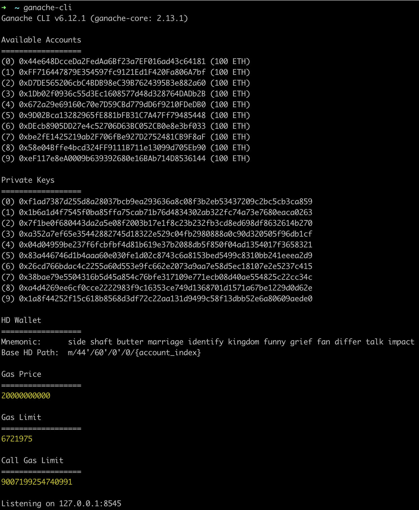
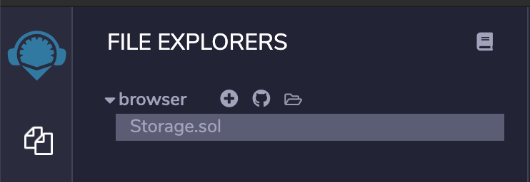
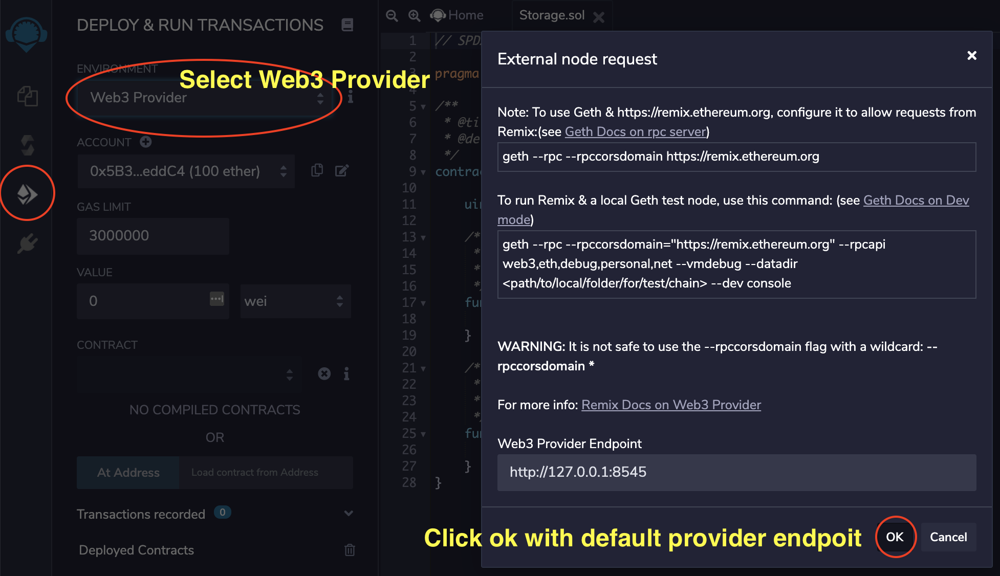
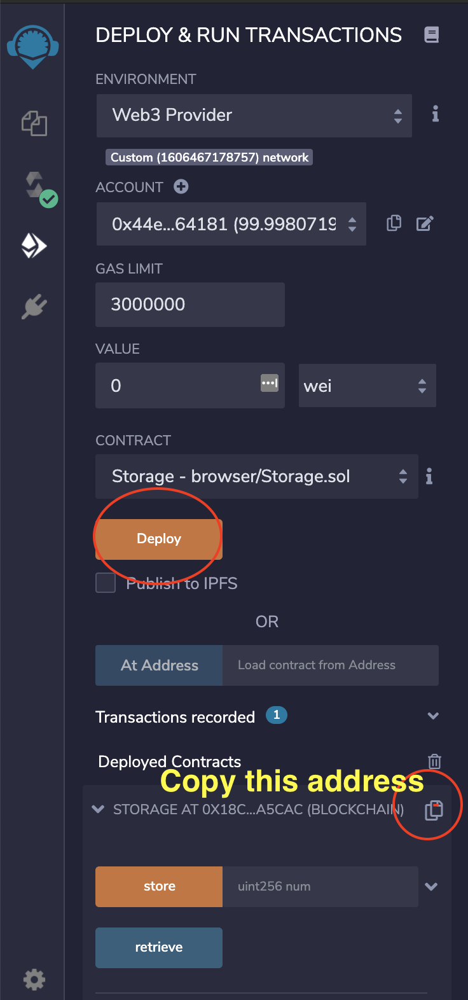

# api-demo
Demo of frontend, backend, and smart contract connection

### Install

- [Node 12.x.x](https://nodejs.org)
- [NPM 6.x.x](https://nodejs.org)

### Steps

- Running local blockchain network
```bash
# install ganache-cli
npm i ganache-cli

# run this command after installing, this will run a blockchain network on localhost:8545 and create 10 accounts
ganache-cli
```

- Compile and deploy [solidity file](contracts/Storage.sol) on remix
  1. Upload solidity file on remix and select it
  
  2. Compile selected solidity file
  
  3. Deploy the compiled contract and copy the address. <b>Update the address found on [index.js](index.js#11)</b>
  
  
- Run your backend on a different terminal window
```bash
npm install
npm start
```
- Open your frontend at http://localhost:3000


### Diagram
